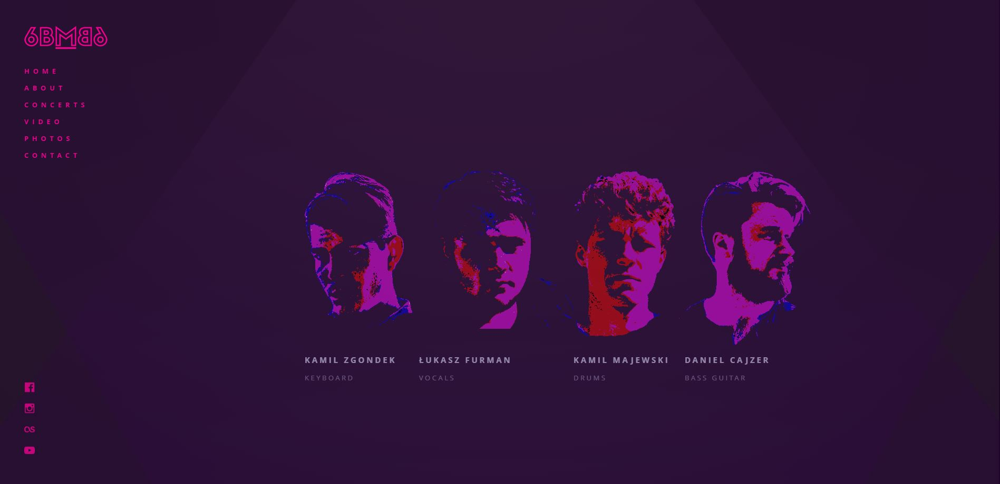

# Project for Daft Academy Frontend course

Frontend project developed as a part of Daft Academy Frontend course.
 
The purpose of this Project was to recreate Rock Band's website according to provided mockup.
 
Project has been developed in HTML, CSS, JS and JQuery technologies.

Part of the developed site has been shown below:
 

